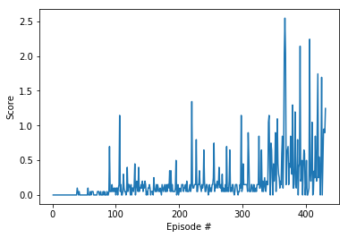

# Project Report

## Project Implementation
Different aspects of implementation have been mentioned below:

#### Learning Algorithm
The learning algorithm used to train the agents is [Deep Deterministic Policy Gradient][ddpg]. The model used to train the agent consists of two neural networks an actor network to take actions and critic network to learn from the actions. 

The actor and critic networks consist each of three fully-connected layers with ReLu activation function used to trigger the output of intermediate states. The first layer has size 800, second has size 600. The third layer of actor network being the output layer is a hyperbolic tan action vector with values between -1 and 1 while that of critic network has a single value output.

The dropout layer with 0.25 dropout rate has been introduced after the critic network's penultimate layer to avoid overfitting.
 
[ddpg]: https://arxiv.org/abs/1509.02971

#### Hyperparameters
The following hyperparameters have been set for learning:

* The replay buffer size is 1 million.

* Learning batch size is selected as 512.

* The discount rate is selected as 0.99.

* Soft-update rate of target weights is 0.1.

* Learning-rates of 5e04 and 1e-3 are selected for actor and critic networks respectively.

## Results
The environment was solved in 431 episodes with an average score of 0.51 for last 100 episodes over both agents.

## Future Ideas
For more stable performance, Trust Region Policy Optimization (TRPO) and Truncated Natural Policy Gradient (TNPG) can be implemented as discussed [here][link]. 

[link]: https://arxiv.org/abs/1604.06778 

[Proximal Policy Optimization (PPO)][PPO] has also demonstrated good performance with continuous control tasks.

[PPO]: https://openai.com/blog/openai-baselines-ppo/

A recent [Distributed Distributional Deterministic Policy Gradients (D4PG)][D4PG] algorithm is another method for adapting DDPG for continuous control.

[D4PG]: https://openreview.net/forum?id=SyZipzbCb
